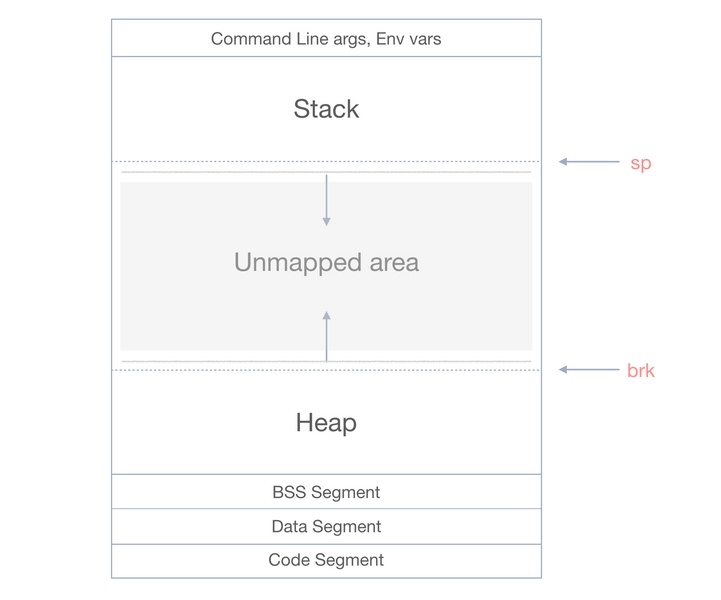
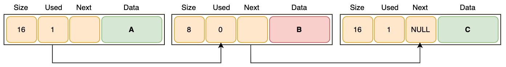

# Allocators

###### by Paul-Arthur Astier 495122

Allocators are an important part of the C++ programming language, as they are responsible for managing the allocation
and deallocation of memory. In this blog series, we'll take an in-depth look at C++ allocators, including their usage,
implementation, and all the different algorithms that go into making one.

We'll start by discussing the fundermental concepts of memory management, including how the heap and stack work. From there, we'll
explore basic from of memory storage and organisation.

Along the way, we'll dive into the implementation details of allocators, including how to allocate memory manually using
`sbrk()`, and memory management strategies and performance considerations. We will also explore additional details
for implementation and other possible algorithm that could have been used.

## Heap, Stack and Memory Mapping

Before we can start, we have to talk about the heap and the stack. The heap and the stack are the two fundamental
concepts of memory and its management.

### The Stack

The stack is a region of memory that is used for storing local variables and function call frames. When a function is
called, a new stack frame is created, and local variables for that function are allocated on the stack. When the
function returns, the stack frame is deallocated, freeing the memory used by the local variables.

### The Heap

The heap, on the other hand, is a region of memory that is used for dynamic memory allocation. When you allocate memory
on the heap, you request a block of memory from the operating system at runtime. This memory can be used for storing
data that persists beyond the lifetime of a single function call, such as objects that need to be shared between
multiple functions or across threads.

When a program starts, the operating system reserves space in the virtual address space for the stack and heap. The
regions between the stack and heap are left unallocated (unmapped area) . When the program dynamically allocates memory
using `malloc()` or `new`, the operating system maps a portion of the unallocated region onto the heap. When a
new function is called, the stack grows downwards into the unallocated region. The unallocated region may not be
contiguous, and the operating system may impose restrictions on the size or location of the stack and heap.

### Memory Mapping Implementaion

In our case, we will be using two different implementations, `sbrk()` & `nmap()`. The sole reason in doing so is for the purpose of being able to expand on the research topic, implementing a custom allocator, by being able to compare the performance through a series of benchmark tests. Both mechanisms use different system calls for memory allocation, thus meaning they embody different characteristics. Starting with `sbrk()`, we will break down the distinct characteristics in an indepth manner.

#### Sbrk():

- The `sbrk()` mechanism puppeteers

Figure 1. Virtual memory layout\_

## Basic Memory Management

The first step building a memory management system is to figure out how to handle your data. There are many data structures that we could use, such as binary trees, hash tables or even graphs, but we will stick to the singly linked list. The diagram shows the workings of the linked list in a visual manner.

_Figure 2. Linked List Implementation_

For each node of the linked list, we will create a Chunk, which will contain header data about the memory that we have stored.
The header data that is included in a chunk:

- Size

  - The size is the value of the amount of allocated memory, excluding the header, avaiable in the chunk.

- Flag (Used)

  - The used flag indicates whether the chunk is currently allocated. When set to false, it's available for allocation.

- Pointer (Next)
  - The next pointer is what allows the linked list to actually be formed. Its a pointer that points to the next chunk in a the linked list. When set to null determines the end of the linked list.

With just these data variables defined and setup in the header, we are able to manage and traverse our memory Pool

Taking a closer look at just a single node(chunk) in our linked list, we can see it is made up of three seperate sections.

_Figure 3. Structure of a single chunk_

- Object Header

  - The section containing the metadata i.e size, flag and pointer.

- Payload

  - The section that holds the data that the user wants to allocate to memory.

- Alignment
  - This section is simply a padding used to align the chunk correctly in memory. The alignment is usually a multiple of the largest primitive type. On a x64 architechture this is usually 8 bytes.

Inorder to get a better understanding of the alignment section, we can create a simple theoretical example.

Given that the object header contains 24 bytes and the Payload contains 64 bytes :

**Header**

- size - 8 bytes
- flag - 1 byte
- padding - 7 bytes
- pointer - 8 bytes

**Payload**

- Size of alloacted memory - 64 bytes

**Padding(alignment)**

- Since 24(header) + 64(payload) = 88. The sum of the size of the header and the payload is a multiple of 8.

- Considering we are using a x64 system we will not need any extra padding outside of the header and payload at the end of the chunk.

- Although, the header needs 7 bytes of padding to ensure that the 'next' pointer starts at an 8 byte aligned memory address.

- If the payload doesn't end on an 8-byte boundary, extra bytes are added at the end of the chunk to ensure the total chunk size is aligned to 8 bytes. This is what is being represented in the diagram above.
