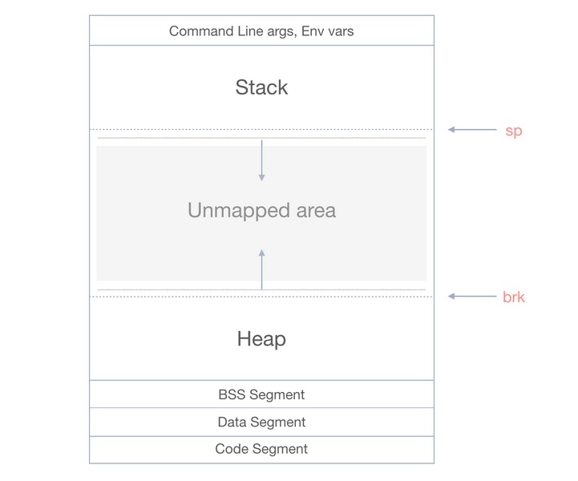

# Allocators 
###### by Paul-Arthur Astier 495122

Allocators are an important part of the C++ programming language, as they are responsible for managing the allocation 
and deallocation of memory. In this blog series, we'll take an in-depth look at C++ allocators, including their usage, 
implementation, and all the different algorithms that go into making one.

We'll start by discussing the basics of memory management, including how the heap and stack work. From there, we'll 
explore basic from of memory storage and organisation.

Along the way, we'll dive into the implementation details of allocators, including how to allocate memory manually using
```sbrk()```, and memory management strategies and performance considerations. We will also explore additional details 
for implementation and other possible algorithm that could have been used.

## Heap, Stack and Memory Mapping

Before we can start, we have to talk about the heap and the stack. The heap and the stack are the two fundamental 
concepts of memory and its management. 

The stack is a region of memory that is used for storing local variables and function call frames. When a function is 
called, a new stack frame is created, and local variables for that function are allocated on the stack. When the
function returns, the stack frame is destroyed, and the memory used by local variables is freed.

The heap, on the other hand, is a region of memory that is used for dynamic memory allocation. When you allocate memory 
on the heap, you request a block of memory from the operating system at runtime. This memory can be used for storing 
data that persists beyond the lifetime of a single function call, such as objects that need to be shared between 
multiple functions or across threads.

When a program starts, the operating system reserves space in the virtual address space for the stack and heap. The 
regions between the stack and heap are left unallocated (unmapped area) . When the program dynamically allocates memory 
using ```malloc()``` or ```new```, the operating system maps a portion of the unallocated region onto the heap. When a 
new function is called, the stack grows downwards into the unallocated region. The unallocated region may not be 
contiguous, and the operating system may impose restrictions on the size or location of the stack and heap. 

In our case, we will be using ```sbrk()``` to manually move the brk pointer, increasing the available space within the 
heap.



&nbsp;&nbsp;&nbsp;&nbsp;&nbsp;&nbsp;&nbsp;&nbsp;&nbsp;&nbsp;&nbsp;&nbsp;&nbsp;&nbsp;&nbsp;&nbsp;&nbsp;&nbsp;&nbsp;&nbsp;&nbsp;&nbsp;&nbsp;&nbsp;&nbsp;&nbsp;&nbsp;&nbsp;&nbsp;&nbsp;&nbsp;&nbsp;&nbsp;&nbsp;&nbsp;&nbsp;&nbsp;&nbsp;&nbsp;&nbsp;&nbsp;&nbsp;&nbsp;&nbsp;&nbsp;&nbsp;&nbsp;&nbsp;&nbsp;&nbsp;&nbsp;&nbsp;&nbsp;&nbsp;&nbsp;&nbsp;&nbsp;&nbsp;&nbsp;&nbsp;&nbsp;&nbsp;&nbsp;&nbsp;&nbsp;&nbsp;&nbsp;&nbsp;*Virtual memory layout*

## Basic Memory Management

The first step to making a memory management system is to figure out how to handle our data. There are many data 
structures that we could use, such as binary trees, hash tables or even graphs, but we will stick to the simple singly
linked list. 

For each node of the linked list, we will create a Chunk, which will contain some header data about the memory that we 
have stored. The header data is fo these chunks are: the size of the allocated memory, a used flag, a pointer to the 
next chunk. With just these data variables, we are able to manage our 


