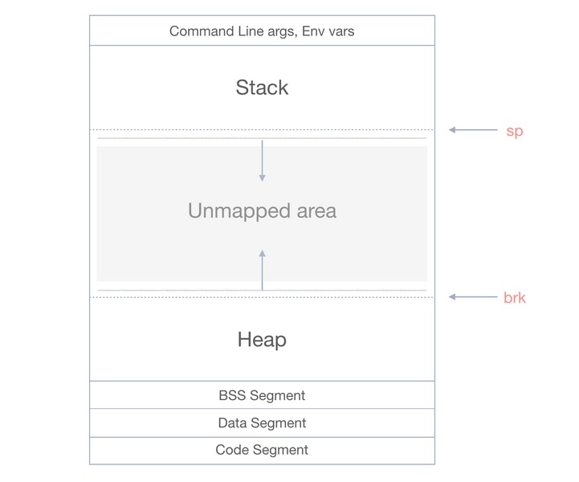
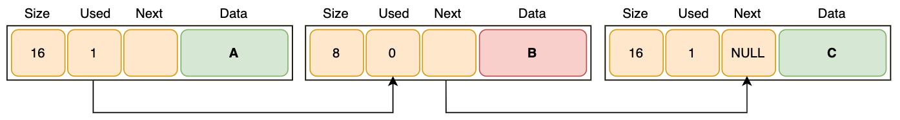
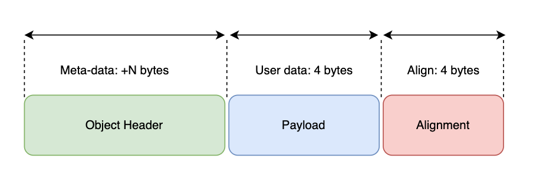

# Allocators

###### by Paul-Arthur Astier 495122

Allocators are an important part of the C++ programming language, as they are responsible for managing the allocation
and deallocation of memory. In this blog series, we'll take an in-depth look at C++ allocators, including their usage,
implementation, and all the different algorithms that go into making one.

We'll start by discussing the fundamental concepts of memory management, including how the heap and stack work. From there, we'll explore basic from of memory storage and organisation.

Along the way, we'll dive into the implementation details of allocators, including how to allocate memory manually using
`sbrk()`, and memory management strategies and performance considerations. We will also explore additional details
for implementation and other possible algorithm that could have been used.

## Heap, Stack and Memory Mapping [1]

Before we can start, we have to talk about the heap and the stack. The heap and the stack are the two fundamental
concepts of memory and its management.

### The Stack

The stack is a region of memory that is used for storing local variables and function call frames. When a function is
called, a new stack frame is created, and local variables for that function are allocated on the stack. When the
function returns, the stack frame is deallocated, freeing the memory used by the local variables.

### The Heap

The heap, on the other hand, is a region of memory that is used for dynamic memory allocation. When you allocate memory
on the heap, you request a block of memory from the operating system at runtime. This memory can be used for storing
data that persists beyond the lifetime of a single function call, such as objects that need to be shared between
multiple functions or across threads.

When a program starts, the operating system reserves space in the virtual address space for the stack and heap. The
regions between the stack and heap are left unallocated (unmapped area) . When the program dynamically allocates memory using `malloc()` or `new`, the operating system maps a portion of the unallocated region onto the heap. When a
new function is called, the stack grows downwards into the unallocated region. The unallocated region may not be
contiguous, and the operating system may impose restrictions on the size or location of the stack and heap.

### Memory Mapping Implementaion

In our case, we will be using two different implementations, `sbrk()` & `mmap()`. The sole reason in doing so is for the purpose of being able to expand on our research topic, implementing a custom allocator, by also comparing the performance through a series of benchmark tests. Both mechanisms use different system calls for memory allocation, thus meaning they embody different characteristics. We will break down the mechanism and characterstics, starting with `sbrk()`.

  
_Figure 1. Virtual memory layout [2]_

#### `sbrk():` [3]

      Chunk *memory_map_sbrk(std::size_t size)
      {
        auto chunk = (Chunk*)sbrk(0);
        if(sbrk(allocSize(size)) == (void*)-1 )
        {
            return nullptr;
        }
        return chunk;
      }

- The `sbrk()` mechanism puppeteers the program break. Essentially, this is what allows the heap to be expanded and contracted.

- Calling `sbrk()` with a postive argument increases the data segement size, internally adding more contiguous memory to the heap.

- While calling `sbrk()` with a negative argument decreases the data segement size.

- Simple Management - The heap grows linearly, simplifying the management system. Although, deallocation of memory with `sbrk()` is actually more complex as it invloves custom logic within the allocator itself.

- Contiguous Memory - Beneficial for performance when dealing with sequential access patterns.

- Portability - `sbrk()` caters for Unix.

- Fragmentation Potentiality - Even though `sbrk()` abides by contiguous memory, constant allocation and deallocation of varying sizes can lead to external fragmentation. There is in fact sufficient memory in total but not in a individual contiguous block.

#### `mmap():` [4]

      Chunk *memory_map_mmap(std::size_t size)
        {
        std::size_t total_size = allocSize(size);

        void *addr = mmap(nullptr, total_size, PROT_READ | PROT_WRITE, MAP_PRIVATE | MAP_ANONYMOUS, -1, 0);

        if (addr == MAP_FAILED)
        {
            return nullptr;
        }

        return static_cast<Chunk *>(addr);
      }

- The `mmap()` system call creates a new mapping in virtual address space of a specific process.

- `mmap()` maps files or devices into memory. This type of memory mapping is assocaited with a file on disk and is known as _file-backed_.

- Moreover, `mmap()` can handle none file backed mapping. This is known as _anonymous_ mapping. A new region of virtual memory, private to the process, is created.

- _Anonymous_ memory mapping allocates memory that is not associated with a file. This is useful for creating a private memory region for our alloacator.

- There is number of key arguments to consider when using `mmap()`.

  - _length_ - The length of the mapping bytes.
  - _addr_ - The suggested starting address for the mapping.
  - _flags_ - Flags that provide control of the mapping behaviour.
    - `PROT_READ`
    - `PROT_WRITE`
    - `PROT_EXEC`
    - `MAP_PRIVATE`
    - `MAP_SHARED`
    - `MAP_ANONYMOUS`
  - _fd_ - File descriptor when mapping a file. It is set to -1 to indicate an anonymous mapping.
  - _offset_ - Offset position in within the file to start the mapping from.

## Benchmark Implementation [5]

In order to benchmark and analyse the performance of `sbrk()`, `mmap()` and the standard C++ allocator, we can design tests to focus on key performance indicators.

### Benchmark Design:

- _Allocation Sizes_ - Test with a varied range of allocation sizes, categorised as: small, medium and large.

  - _Small_ : 1 byte, 10 bytes, 100 bytes
  - _Medium_ : 1 KB, 10 KB, 100 KB
  - _Large_ : 1 MB, 10 MB, 100 MB

- _Number of Allocation_ - We can use a varied number of allocations in each performed test. This will facilitate the evaluation of how the allocators scale with increased demand.

- _Allocation Patterns_ - Use different allocation patterns, for example:
  - Sequential Allocation
  - Random Allocation
  - Mixed workload of allocation.
- _Metrics_
  - Memory Usage
  - Allocation Time
  - Deallocation Time
  - Fragmentation

## Basic Memory Management [6]

The first step building a memory management system is to figure out how to handle your data. There are many data structures that we could use, such as binary trees, hash tables or even graphs, but we will stick to the singly linked list. The diagram shows the workings of the linked list in a visual manner.

For each node of the linked list, we will create a Chunk, which will contain header data about the memory that we have stored.
The header data that is included in a chunk:

      class Chunk
      {
      public:
          std::size_t size;
          bool used;
          Chunk* next;
          intptr_t data[1];
      };

- Size

  - The size is the value of the amount of allocated memory, excluding the header, avaiable in the chunk.

- Flag (Used)

  - The used flag indicates whether the chunk is currently allocated. When set to false, it's available to be reallocated.

- Pointer (Next)
  - The next pointer is what allows the linked list to actually be formed. Its a pointer that points to the next chunk in a the linked list. When set to null determines the end of the linked list.

With just these data variables defined and setup in the header, we are able to manage and traverse our memory Pool.

Taking a closer look at just a single node(chunk) in our linked list, we can see it is made up of three seperate sections, as well as the payload.


_Figure 2. Structure of a single chunk_

- Object Header

  - The section containing the metadata i.e size, flag and pointer.

- Payload

  - The section that holds the data that the user wants to allocate to memory.

- Alignment
  - This section is simply a padding used to align the chunk correctly in memory. The alignment is usually a multiple of the largest primitive type. On a x64 architechture this is usually 8 bytes.

In order to get a better understanding of the alignment section, we can create a simple theoretical example.

Given that the object header contains 24 bytes and the Payload contains 64 bytes :

**Header**

- size - 8 bytes
- flag - 1 byte
- padding - 7 bytes
- pointer - 8 bytes

**Payload**

- Size of alloacted memory - 64 bytes

**Padding(alignment)**

    std::size_t align(std::size_t size)
    {
        auto i = 8;
        while (i < size)
        {
            i *= 2;
        }
        return i;
    }

- Since 24(header) + 64(payload) = 88. The sum of the size of the header and the payload is a multiple of 8.

- Considering we are using a x64 system we will not need any extra padding outside of the header and payload at the end of the chunk.

- Although, the header needs 7 bytes of padding to ensure that the 'next' pointer starts at an 8 byte aligned memory address.

- If the payload doesn't end on an 8-byte boundary, extra bytes are added at the end of the chunk to ensure the total chunk size is aligned to 8 bytes. This is what is being represented in the diagram above.


_Figure 3. Padding is added to the object header as N_

## Memory Linked-List [7] [8]

The chosen algorithm for the memory pool is a singly linked list, which can be managed using different types of algorithms. When data is requested by the user, a chunk is created on the heap, and is added at the end of the list. When the user frees data, the chunk used flag is set to false, which means it needs to be reused.

This section will talk about how the memory is managed, with the types of reuse algorithms implemented, and the functions used to map and store memory.

### Search Algorithms

Most of the work done in the memory linked list class is the search algorithms when resuing data. When the user frees data, the class simply marks the chunks used flag to false. The difficult part comes when reusing this chunk for new data. Chunks can only be reused if the new data is the same or smaller in size then the unused chunk.

There are multiple ways to find chunks within the linked-list, and we implemented some of these in the class. The search algorithm can be selected within the class, depending on waht the user needs.

    Chunk *first_fit(std::size_t size)
    {
        for (auto s = m_initial; s != nullptr; s = s->next)
        {
            if (!s->used && s->size >= size)
            {
                return s;
            }
        }
        return nullptr;
    }

#### First Fit:

    This algorithm is very simple, and it goes through the entire linked-list from top to bottom, checking each node if thier flag is flase, and if it has the minimum required size.

#### Next Fit:

    Similarly to first fit, it goes through the list from top to bottom. However, once a suitable chunk is found, its placement is stored so the algorithm doesnt have to start from the beggining again, making it slightly more efficient.

#### Best Fit:

    This algorithms goal is to find a chunk that best matches the data requested. First it goes throught the whole list checking if they are chunks that are big enough to be used. Then it will go through the biggest ones, storing a usable chunk. This is reapeated with a size under, until no usauble chunks are found, using the last store chunk.

#### Free Listing:

    Free Listing algorithm uses a whole different linked list to store freed chunks. When a chunk is freed, instead of just setting the flag to false, the free function will also rearrange the memory list, putting the freed chunk at the end of the freed list. When the user requests memory, all the class has to do is to look through the free list, instead of the whole memory.

### Allocator

    intptr_t *alloc(std::size_t size)
    {
        auto aligned = align(size);
        if (auto freed_chunk = find_chunk(aligned))
        {
            freed_chunk->used = true;
            return freed_chunk->data;
        }
        auto chunk = memory_map(aligned);
        chunk->size = aligned;
        chunk->used = true;
        if (m_start != nullptr)
        {
            m_end->next = chunk;
        }
        if (m_initial == nullptr)
        {
            m_initial = chunk;
            m_next_fit_chunk = chunk;
            m_start = chunk;
        }
        m_end = chunk;
        return chunk->data;
    }

The allocator functions goes through a couple of steps when called.

- Aligning
- Reusing (if avialble)...
- ... Or allocating on the heap
- Adding the new chunk to the list...
- ... Or initialising the linked list

The function `alloc(size)` is what the class uses
to request memory from the OS. The argument `size`
is the bytes of memory requested from the user. Either
`sbrk()` or `mmap()` can be specified when allocating
memory. The very first thing the allocator does is to
find the minimum size required for the data to be aligned.

After aligning, the function will first look if they are
chunks that could be reused, using the chosen algorithm by
the user. If a chunk was found, then the function will
return this pointer to the user, so they can rewritte and
re user it. If no chunks where found, then the function
continues.

If the function continues, it will request memory
from the heap using the alignment amount of bytes.
This will be done either with `sbrk()` or `mmap`, and
will return a non nullptr chunk. The returned chunk header
will be intialized, setting the siae and putting the used
flag to true.

Once the chunk is initialized, it will be added to
the memory linked list. If the list already exists, it
is sipmly added to the end. If the linked list does not
exists, then it will be initialized, with the new chunk
being the start. Once everything is done, the function
will return the pointer to the chunks payload data, so
the user can use it.

### Helper Functions

The `alloc()` function needs a lot of helper funcitons
to make the allocation of the data work. Some of these
functions are wuite simple, and some are there to manage
settings such as the type of allocator used.

#### `align(size):`

    align(size) is a simple function that finds the minimum bytes needed for the data that needs to be allocated. It starts with a minimum target size of 8 bytes, and compares it to the passed argument size. If size is bigger, then align will double the target size until it is bigger the size provided. This ensures that the chunk is aligned, making it fit within the hexadecimal architecture.

#### `alocSize():`

    Similarly to align, this will return the size of the chunk to be allocated. It returns the size of the data that needs to be allocated, plus the size of the header. The header however, already has the first pointer of the user data, so it is subtracted.

#### `free()`

    Free is used to mark chunks for reuse, and all it does is set the used flag to false. If the freelisting setting is selected, then it will also put the chunk in the free list.

#### `getheader()`

    static Chunk* get_header(intptr_t* data)
    {
        return (Chunk*)((char*)data + sizeof(std::declval<Chunk>().data) - sizeof(Chunk));
    }

    This function is used to get the header of the chunk. When the user allocates data, they only get the pointer of the data, and has no access to the header. When data is being freed, the system needs to get back to the header, so it can set its flag to false.

## Standard Container Wrapper

Originally, the custom allocator operated only through direct function calls. This meant the inclusion of C++ Standandard Template Library (STL) containers like `std::vector`, `std::map` and `std::list`. This limitation posed an obstacle, as it disallows smooth utilisation of the custom allocator with these containers.

To seamlessly integrate the custom allocator with C++ STL containers, a vital adaptation layer is required. This section introduces the Standard Container Wrapper, a crucial wrapper class that acts as an adapter. The wrapper conforms to the STL interface, while delegating predetermined memory opertaions to the underlying custom `Memory_Linked_List` allocator.

As this solution effectively connects the gap between the custom memory managment and C++ STL containers, we'll delve deeper into the wrappers implementation.

1. **Template Class:**

```
template <typename T>
class allocator_wrapper
```

- This code turns the following wrapper class into a template, allowing it to be used with any data type (T).

2. **Standard Allocator Interface:**

```
 using value_type = T;
 using pointer = T*;
 using const_pointer = const T*;
 using size_type = std::size_t;
 using difference_type = std::ptrdiff_t;
```

- The type aliases are necessary for STL to interact with the allocator. They define the standard types for the custom allocator to work within the STL framework.

3. **Constructor and Destructor:**

```
  allocator_wrapper() noexcept = default;
  ~allocator_wrapper() noexcept = default;

  template <typename U>
  allocator_wrapper(const allocator_wrapper<U>&) noexcept {}
```

- The constructor & deconstructor are assigned to default, while the copy constructor template provides compatibility when copying or assigning containers with a possible diffenece in allocator type.

4. **allocate():**

```
T* allocate(std::size_t size) noexcept
    {
        intptr_t* ptr = mll.alloc(size * sizeof(T));
        return reinterpret_cast<T*>(ptr);
    }

```

- This is the core of the allocator template. It receive the specifed size and then calls the `mll.alloc()`, which allocates enough memory for size number of elements of type **T**.
  The returned `intptr_t` is then casted to a T\*.

5. **deallocate():**

```
 void deallocate(T* data, std::size_t) noexcept
    {
        // Cast back to intptr_t* before freeing the memory.
        mll.free(reinterpret_cast<intptr_t*>(data));
    }
```

- This function frees the memory allocated by `allocate()`. It receives the pointer, cast it then passes it to the `mll.free()`.

6. **Comparison Operators:**

```
bool operator==(const allocator_wrapper&) const noexcept { return true; }

bool operator!=(const allocator_wrapper&) const noexcept { return false; }
```

- This implementation is required to define all instances of allocator_wrapper as equal.

7. **rebind Struct:**

```
template <typename U>
    struct rebind
    {
        using other = allocator_wrapper<U>;
    };
```

- This is a major component for the STL compatibility. The rebind Struct allows the containers to gather an allocator for a different type 'U' from the allocator for type 'T'.

8. **Memory_Linked_List Member**:

```
private:
    Memory_Linked_List mll{};
```

- This private member `mll` of type `Memory_Linked_List` is an instance of the custom memory allocator that allocator_wrapper uses to perform the actuall allocationa and deallocation.

In essence, each allocator wrapper instance has its own `Memory_Linked_List` object, allowing the use of the custom allocator with standard containers.

## Sources

[1]
Ankit_Bisht, “Stack vs Heap Memory Allocation - GeeksforGeeks,” GeeksforGeeks, Dec. 26, 2018. https://www.geeksforgeeks.org/stack-vs-heap-memory-allocation/

[2]
D. Soshnikov, Memory Layout. 2019. Available: http://dmitrysoshnikov.com/compilers/writing-a-memory-allocator/

‌[3]
S. N. Hegde, “mmap, brk and sbrk memory management calls in UNIX,” OpenGenus IQ. https://iq.opengenus.org/mmap-brk-and-sbrk-in-unix/

‌[4]
S. N. Hegde, “mmap, brk and sbrk memory management calls in UNIX,” OpenGenus IQ. https://iq.opengenus.org/mmap-brk-and-sbrk-in-unix/

‌[5]
in, “BENCHMARKING in C++ (how to measure performance),” YouTube, Aug. 07, 2019. https://youtu.be/YG4jexlSAjc?si=pwT2qWWY7peJAHxK (accessed Jan. 28, 2025).

‌[6]
Dmitry Soshnikov, “Writing a Memory Allocator,” Dmitry Soshnikov, Feb. 06, 2019. http://dmitrysoshnikov.com/compilers/writing-a-memory-allocator/

‌[7]
D. Soshnikov, “Writing a Pool Allocator.” http://dmitrysoshnikov.com/compilers/writing-a-pool-allocator/

‌[8]
Dmitry Soshnikov, “Writing a Memory Allocator,” Dmitry Soshnikov, Feb. 06, 2019. http://dmitrysoshnikov.com/compilers/writing-a-memory-allocator/

[9]
“std::allocator - cppreference.com,” en.cppreference.com. https://en.cppreference.com/w/cpp/memory/allocator
